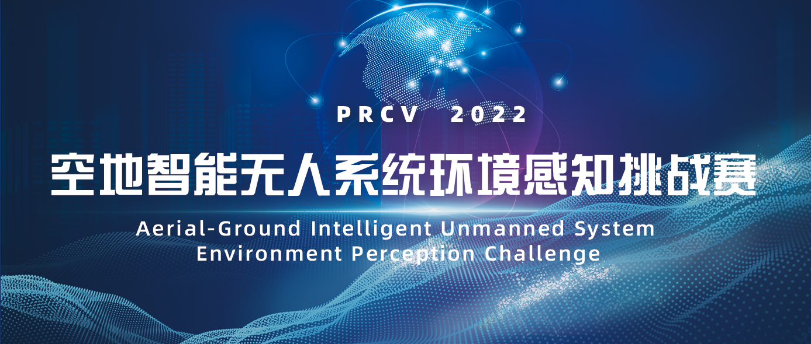
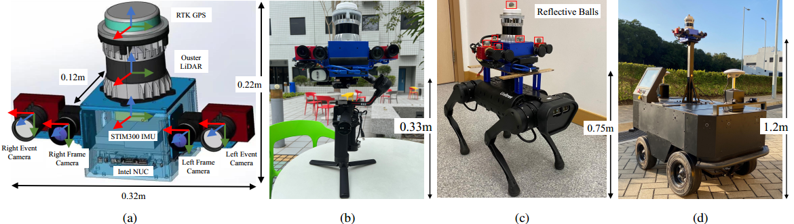
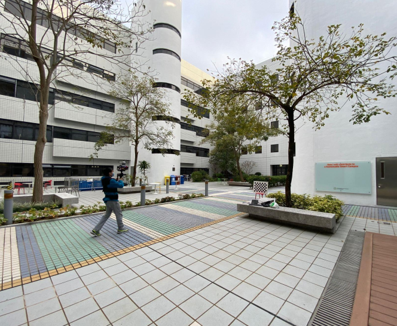
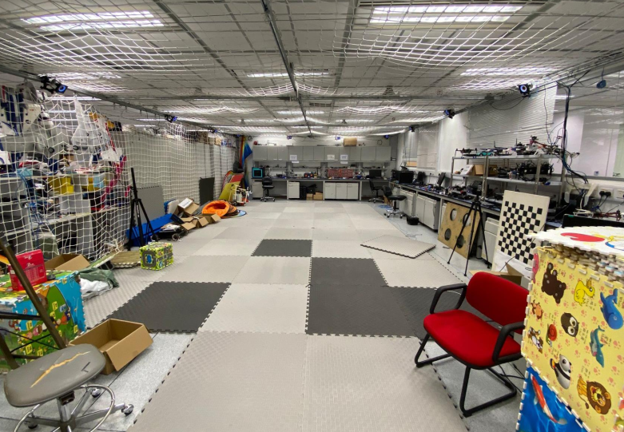
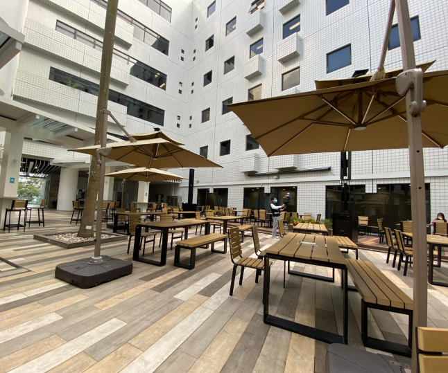
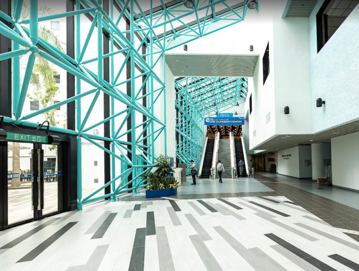
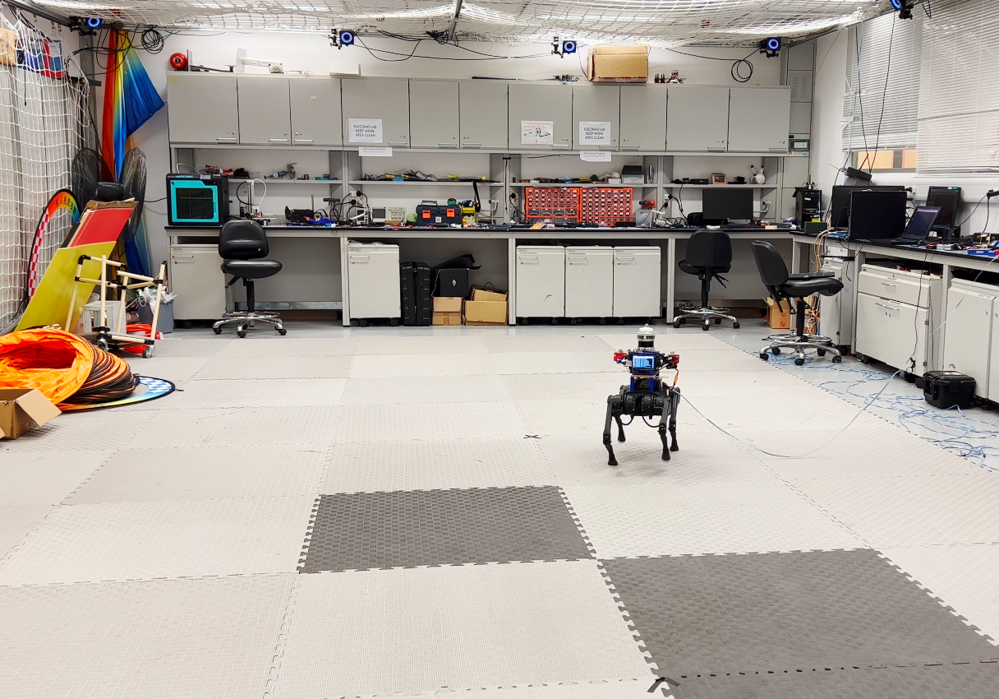
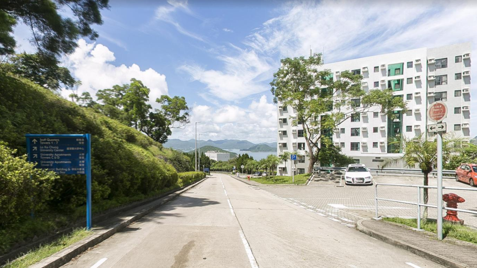
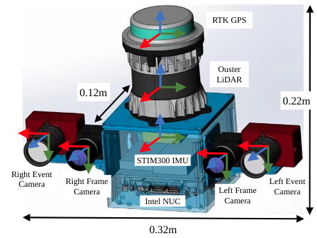

# The FusionPortable-VSLAM Challenge

For more information, we can visit the following websits:

- [homepage of FusionPortable-VSLAM Challenge](http://aiskyeye.com/challenge-2022/visual-slam/)
- [homepage of FusionPortable Dataset](https://ram-lab.com/vslam_dataset/)
- [homepage of PRCV Aerial-Ground Intelligent Unmanned System Environment Perception Challenge](http://aiskyeye.com/)
- [Introduction of PRCV challenge on Wexin Official Accounts Platform](https://mp.weixin.qq.com/s/p1xEpLVKwcI0p37hxe3c7w)

# Introduction

| Sensor                      | Characteristics                                 |
| --------------------------- | ----------------------------------------------- |
| 3D LiDAR (**not provided**) | Ouster OS1-128, 128 channels, 120m range        |
| Frame Camera * 2            | FILR BFS-U3-31S4C， resolution: 1024 × 768      |
| Event Camera * 2            | DAVIS346, resolution: 346 × 240，2 built-in imu |
| IMU (body_imu)              | STIM300                                         |
| GPS                         | ZED-F9P RTK-GPS                                 |
| Ground Truth                | Leica BLK 360                                   |

* This visual [SLAM](https://en.wikipedia.org/wiki/Simultaneous_localization_and_mapping) benchmark is based on the [FusionPortable dataset](https://ram-lab.com/file/site/multi-sensor-dataset), which covers a variety of environments in [The Hong Kong University of Science and Technology](https://hkust.edu.hk) campus by utilizing multiple platforms for data collection. It provides a large range of difficult scenarios for Simultaneous Localization and Mapping (SLAM). 
* All these sequences are characterized by structure-less areas and varying illumination conditions to best represent the real-world scenarios and pose great challenges to the SLAM algorithms which were verified in confined lab environments. 

- [see here for detailed information of the challenge](doc/vslam_evaluation.md)
- [see here for the IROS paper of FusionPortable dataset [1]](doc/FusionPortable_IROS_2022.pdf)

# Download

## Calibration files

| Yaml Files      | Describtion                                             | Link                                                         |
| --------------- | ------------------------------------------------------- | ------------------------------------------------------------ |
| body_imu        | extrinsics and intrinsics of the STIM300                | [body_imu.yaml](http://prcv-download.natapp1.cc/calib/body_imu.yaml) |
| event_cam00     | extrinsics and intrinsics of the left event camera      | [event_cam00.yaml](http://prcv-download.natapp1.cc/calib/event_cam00.yaml) |
| event_cam00_imu | extrinsics and intrinsics of the left event camera imu  | [event_cam00_imu.yaml](http://prcv-download.natapp1.cc/calib/event_cam00_imu.yaml) |
| event_cam01     | extrinsics and intrinsics of the right event camera     | [event_cam01.yaml](http://prcv-download.natapp1.cc/calib/event_cam01.yaml) |
| event_cam01_imu | extrinsics and intrinsics of the right event camera imu | [event_cam01_imu.yaml](http://prcv-download.natapp1.cc/calib/event_cam01_imu.yaml) |
| frame_cam00     | extrinsics and intrinsics of the left flir camera       | [frame_cam00.yaml](http://prcv-download.natapp1.cc/calib/frame_cam00.yaml) |
| frame_cam01     | extrinsics and intrinsics of the right flir camera      | [frame_cam01.yaml](http://prcv-download.natapp1.cc/calib/frame_cam01.yaml) |
| ouster00_imu    | extrinsics and intrinsics of the ouster imu             | [ouster00_imu.yaml](http://prcv-download.natapp1.cc/calib/ouster00_imu.yaml) |

## Test Sequences

| Platform |                                                              | Sequence            | Compressed Bag                                               |
| -------- | ------------------------------------------------------------ | ------------------- | ------------------------------------------------------------ |
| Handheld |  | 20220216_garden_day | [20.4GB](http://prcv-download.natapp1.cc/compressed/20220216_garden_day.bag) |

## Calibration Sequences

| Platform |                                                              | Sequence             | Compressed Bag |
| -------- | ------------------------------------------------------------ | -------------------- | -------------- |
| Handheld |  | **comming soon!!!!** |                |

## Challenge Sequences

| Platform        |                                                              | Sequence               | Compressed Bag                                               |
| --------------- | ------------------------------------------------------------ | ---------------------- | ------------------------------------------------------------ |
| Handheld        |  | 20220216_canteen_night | [15.9GB](http://prcv-download.natapp1.cc/compressed/20220215_canteen_night.bag) |
|                 |                                                              | 20220216_canteen_day   | [17.0GB](http://prcv-download.natapp1.cc/compressed/20220216_canteen_day.bag) |
|                 |  | 20220215_garden_night  | [8.5GB](http://prcv-download.natapp1.cc/compressed/20220215_garden_night.bag) |
|                 |                                                              | 20220216_garden_day    | [20.4GB](http://prcv-download.natapp1.cc/compressed/20220216_garden_day.bag) |
|                 |  | 20220216_corridor_day  | [27.4GB](http://prcv-download.natapp1.cc/compressed/20220216_corridor_day.bag) |
|                 |  | 20220216_escalator_day | [31.7GB](http://prcv-download.natapp1.cc/compressed/20220216_escalator_day.bag) |
|                 |  | 20220225_building_day  | [37.5GB](http://prcv-download.natapp1.cc/compressed/20220225_building_day.bag) |
|                 |  | 20220216_MCR_slow      | [3.5GB](http://prcv-download.natapp1.cc/compressed/20220216_MCR_slow.bag) |
|                 |                                                              | 20220216_MCR_normal    | [2.2GB](http://prcv-download.natapp1.cc/compressed/20220216_MCR_normal.bag) |
|                 |                                                              | 20220216_MCR_fast      | [1.7GB](http://prcv-download.natapp1.cc/compressed/20220216_MCR_fast.bag) |
| Quadruped Robot |  | 20220219_MCR_slow_00   | [9.7GB](http://prcv-download.natapp1.cc/compressed/20220219_MCR_slow_00.bag) |
|                 |                                                              | 20220219_MCR_slow_01   | [8.4GB](http://prcv-download.natapp1.cc/compressed/20220219_MCR_slow_01.bag) |
|                 |                                                              | 20220219_MCR_normal_00 | [7.1GB](http://prcv-download.natapp1.cc/compressed/20220219_MCR_normal_00.bag) |
|                 |                                                              | 20220219_MCR_normal_01 | [6.5GB](http://prcv-download.natapp1.cc/compressed/20220219_MCR_normal_01.bag) |
|                 |                                                              | 20220219_MCR_fast_00   | [7.6GB](http://prcv-download.natapp1.cc/compressed/20220219_MCR_fast_00.bag) |
|                 |                                                              | 20220219_MCR_fast_01   | [8.5GB](http://prcv-download.natapp1.cc/compressed/20220219_MCR_fast_01.bag) |
| Apollo Vehicle  |  | 20220226_campus_road   | [72.3GB](http://prcv-download.natapp1.cc/compressed/20220226_campus_road_day.bag) |

# FAQ

- **How are the frames defined on the sensor setup?**

The picture below is a schematic illustration of the reference frames (red = x, green = y, blue = z):

- **How are the results scored?**

The results submitted by each team will be scored based on the completeness and ATE accuracy of the trajectories. All the results will be displayed in  the live leaderboard. Each trajectory will be scored based on the standard evaluation points, the accumulation of the scores of all these evaluation points is normalized to 100 points to get the final score of the sequence. Each evaluation point can get 0-10 points according to its accuracy.

- **Will the organizer provide the calibration datasets of the IMU and camera?**

Of course, we will provide the calibration data of IMU and cameras.

- **Is the ground truth available?**

We will provide some sample datasets along with their ground truth collected with the same sensor kit, but the ground truth for the challenge sequences is not available. However, you can submit your own results in the website evaluation system for evaluation.

# Notice

**A team can only register one account.** **Quota can only be obtained by joining the WeChat group**.

In order to prevent the problem of a team registering multiple accounts, this competition requires **all members** of the participating team to **join the WeChat group**. If the QR code is invalid, we will update it in time. And **the old account cannot be used, you need to re-register a new account**.

## Reference

*[1] Jianhao Jiao, Hexiang Wei, Tianshuai Hu, Xiangcheng Hu, etc., Lujia Wang, Ming Liu, FusionPortable: A Multi-Sensor Campus-Scene Dataset for Evaluation of Localization and Mapping Accuracy on Diverse Platforms, IEEE/RSJ International Conference on Intelligent Robots and Systems (IROS), 2022, Kyoto, Japan.*

[2] [HILTI Challenge](https://www.hilti-challenge.com/index.html).