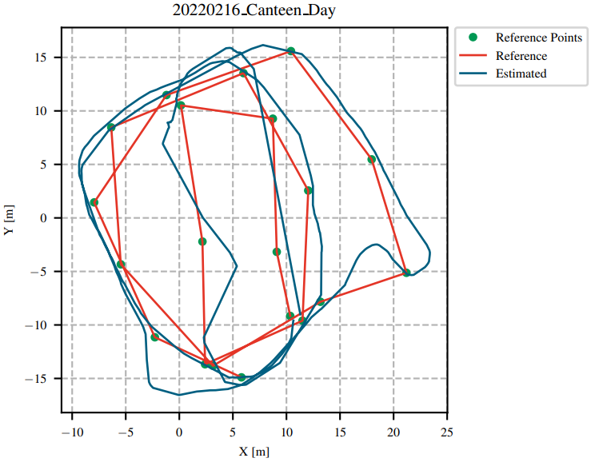
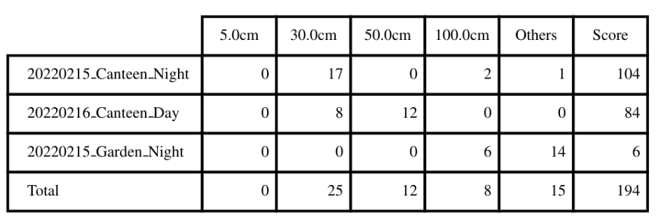
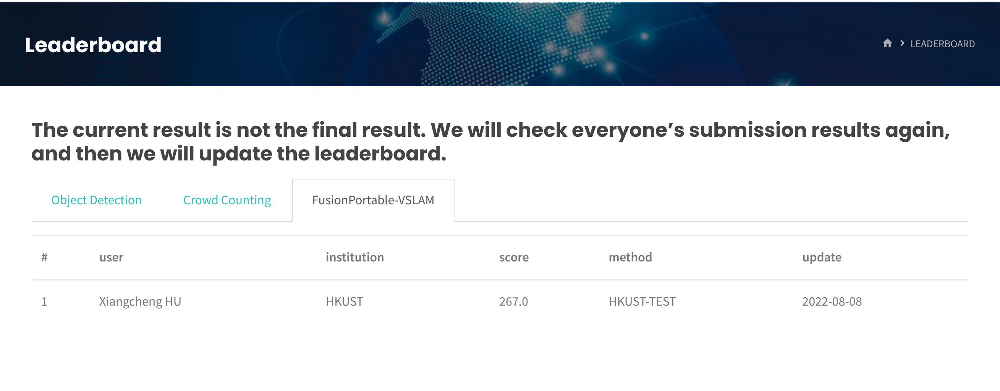
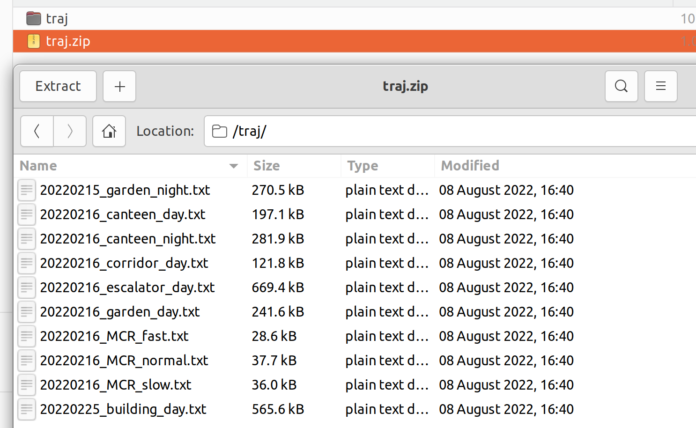
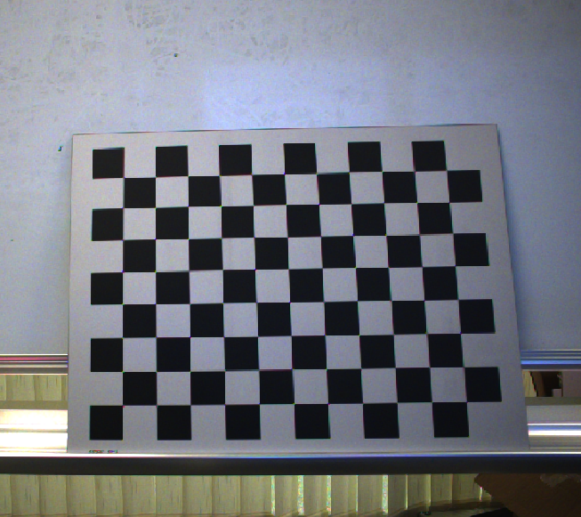
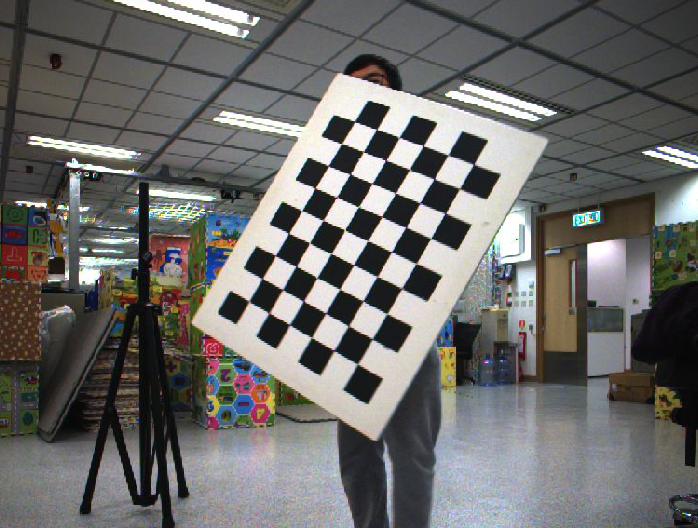
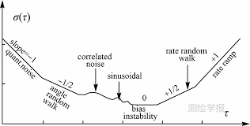

# The FusionPortable-VSLAM Challenge


For more information, we can visit the following websits:

- [homepage of FusionPortable Dataset](https://ram-lab.com/vslam_dataset/)

- [homepage of FusionPortable-VSLAM Challenge](http://aiskyeye.com/challenge-2022/visual-slam/)
- [homepage of PRCV Aerial-Ground Intelligent Unmanned System Environment Perception Challenge](http://aiskyeye.com/)
- [Introduction of PRCV challenge on Wexin Official Accounts Platform](https://mp.weixin.qq.com/s/p1xEpLVKwcI0p37hxe3c7w)

# Introduction


| Sensor                      | Characteristics                                 |
| --------------------------- | ----------------------------------------------- |
| 3D LiDAR (**not provided**) | Ouster OS1-128, 128 channels, 120m range        |
| Frame Camera * 2            | FILR BFS-U3-31S4C， resolution: 1024 × 768      |
| Event Camera * 2            | DAVIS346, resolution: 346 × 240，2 built-in imu |
| IMU (body_imu)              | STIM300                                         |
| GPS                         | ZED-F9P RTK-GPS                                 |
| Ground Truth                | Leica BLK 360                                   |

* This visual [SLAM](https://en.wikipedia.org/wiki/Simultaneous_localization_and_mapping) benchmark is based on the FusionPortable dataset, which covers a variety of environments in [The Hong Kong University of Science and Technology](https://hkust.edu.hk) campus by utilizing multiple platforms for data collection. It provides a large range of difficult scenarios for Simultaneous Localization and Mapping (SLAM). 
* All these sequences are characterized by structure-less areas and varying illumination conditions to best represent the real-world scenarios and pose great challenges to the SLAM algorithms which were verified in confined lab environments. 

- [detailed information of this SLAM challenge](doc/vslam_evaluation.md)

# Latest News

- [08.09]:the ground thruth of 20220216_garden_day released!
- [08.07]: calibration dataset released.
- [08.01]: challenge data sequences released.

# Evaluation

## method

* The submission will be ranked based on the **completeness** and **frequency** of the trajectory as well as on the **position accuracy (ATE)**. The score is based on the ATE of individual points on the trajectory. Points with the error smaller than a distance threshold are added to your final score. This evaluation scheme is inspired by [HILTI Challenge](https://www.hilti-challenge.com/index.html).

* Output trajectories should be transformed into the *body_imu* frame, We will align the trajectory with the dense ground truth points using a rigid transformation. Then the Absolute Trajectory Error (ATE) of a set of discrete point is computed. At each ground truth point, extra penalty points are added to the final score depending on the amount of error at this point:

  | Error    | Score (points) |
  | -------- | -------------- |
  | <= 5cm   | 10             |
  | <= 30cm  | 6              |
  | <= 50cm  | 3              |
  | <= 100cm | 1              |
  | > 100cm  | 0              |

* Each sequence will be evaluated over a maximum of 200 points, which leads to a maximum of  $N\times 200$ points being evaluated among $N$ sequences.

**Given an example:**





## [Leaderboard](http://aiskyeye.com/leaderboard/)

Sign up for an account and submit your results in the evaluation system, the live leaderboard will update your ranking.



# Submission Guidelines

* Trajectory Results

  * Please upload a .zip file consisting of a list of text files named as the *sequence name* shown as follows:

  ```
  20220215_canteen_night.txt
  20220215_garden_night.txt
  20220219_MCR_slow_00.txt
  20220226_campus_road_day.txt
  ....
  ```

  * These text files should put in a folder of **"traj"**, and then compress as a *.zip file, such as "**traj.zip**"

  

  * The text files should have the following contents(TUM format):

  ```
  1644928761.036623716 0.0 0.0 0.0 0.0 0.0 0.0 1.0
  ....
  ```

  Each row contains *timestamp_s tx ty tz qx qy qz qw*. The timestamps are in the unit of second which are used to establish temporal correspondences with the groundtruth. The first pose should be no later than the starting time specified above, and only poses after the starting time will be used for evaluation.

  * The poses should specify the poses of the body IMU in the world frame. If the estimated poses are in the frame of other sensors, one should transform these poses into the world frame of the body IMU as `T_bodyw_body = T_body_sensor * T_sensorw_sensor * T_body_sensor^(-1);`.

* Do not publicly release your trajectory estimates, as we might re-use some of the datasets for future competitions.

# Download

We provide the compressed rosbag data, remember to execute the following command to decompress them.

```bash
# example: 20220216_garden_day_ref_compressed
rosbag decompress 20220216_garden_day.bag
```

## Calibration files

| Yaml Files      | Describtion                                             | Link                                                         |
| --------------- | ------------------------------------------------------- | ------------------------------------------------------------ |
| body_imu        | extrinsics and intrinsics of the STIM300                | [body_imu.yaml](http://prcv-download.natapp1.cc/calib/body_imu.yaml) |
| event_cam00     | extrinsics and intrinsics of the left event camera      | [event_cam00.yaml](http://prcv-download.natapp1.cc/calib/event_cam00.yaml) |
| event_cam00_imu | extrinsics and intrinsics of the left event camera imu  | [event_cam00_imu.yaml](http://prcv-download.natapp1.cc/calib/event_cam00_imu.yaml) |
| event_cam01     | extrinsics and intrinsics of the right event camera     | [event_cam01.yaml](http://prcv-download.natapp1.cc/calib/event_cam01.yaml) |
| event_cam01_imu | extrinsics and intrinsics of the right event camera imu | [event_cam01_imu.yaml](http://prcv-download.natapp1.cc/calib/event_cam01_imu.yaml) |
| frame_cam00     | extrinsics and intrinsics of the left flir camera       | [frame_cam00.yaml](http://prcv-download.natapp1.cc/calib/frame_cam00.yaml) |
| frame_cam01     | extrinsics and intrinsics of the right flir camera      | [frame_cam01.yaml](http://prcv-download.natapp1.cc/calib/frame_cam01.yaml) |

## Test Sequences

| Platform |                                                              | Sequence            | Compressed Bag                                               | Ground Truth                                                 |
| -------- | ------------------------------------------------------------ | ------------------- | ------------------------------------------------------------ | ------------------------------------------------------------ |
| Handheld |  | 20220216_garden_day | [20.4GB](http://prcv-download.natapp1.cc/sample/20220216_garden_day.bag) | [20220216_garden_day.txt](http://prcv-download.natapp1.cc/sample/20220216_garden_day.txt) |

## Calibration Sequences

| Platform |                                                              | Sequence             | Compressed Bag |
| -------- | ------------------------------------------------------------ | -------------------- | -------------- |
| Handheld |  | 20220209_StaticTarget_SmallCheckerBoard_9X12_30mm| [6.7GB](http://prcv-download.natapp1.cc/compressed/20220209_StaticTarget_SmallCheckerBoard_9X12_30mm.bag) |
| Handheld |  | 20220215_DynamicTarget_BigCheckerBoard_7X10_68mm| [2.3GB](http://prcv-download.natapp1.cc/compressed/20220215_DynamicTarget_BigCheckerBoard_7X10_68mm.bag) |
| Handheld |  |20220209_Static_IMUs_3h20mins  | [894MB](http://prcv-download.natapp1.cc/compressed/20220209_Static_IMUs_3h20mins.bag) |


## Challenge Sequences

| Platform        |                                                              | Sequence               | Compressed Bag                                               |
| --------------- | ------------------------------------------------------------ | ---------------------- | ------------------------------------------------------------ |
| Handheld        |  | 20220216_canteen_night | [15.9GB](http://prcv-download.natapp1.cc/compressed/20220215_canteen_night.bag) |
|                 |                                                              | 20220216_canteen_day   | [17.0GB](http://prcv-download.natapp1.cc/compressed/20220216_canteen_day.bag) |
|                 |  | 20220215_garden_night  | [8.5GB](http://prcv-download.natapp1.cc/compressed/20220215_garden_night.bag) |
|                 |                                                              | 20220216_garden_day    | [20.4GB](http://prcv-download.natapp1.cc/compressed/20220216_garden_day.bag) |
|                 |  | 20220216_corridor_day  | [27.4GB](http://prcv-download.natapp1.cc/compressed/20220216_corridor_day.bag) |
|                 |  | 20220216_escalator_day | [31.7GB](http://prcv-download.natapp1.cc/compressed/20220216_escalator_day.bag) |
|                 |  | 20220225_building_day  | [37.5GB](http://prcv-download.natapp1.cc/compressed/20220225_building_day.bag) |
|                 |  | 20220216_MCR_slow      | [3.5GB](http://prcv-download.natapp1.cc/compressed/20220216_MCR_slow.bag) |
|                 |                                                              | 20220216_MCR_normal    | [2.2GB](http://prcv-download.natapp1.cc/compressed/20220216_MCR_normal.bag) |
|                 |                                                              | 20220216_MCR_fast      | [1.7GB](http://prcv-download.natapp1.cc/compressed/20220216_MCR_fast.bag) |
| Quadruped Robot |  | 20220219_MCR_slow_00   | [9.7GB](http://prcv-download.natapp1.cc/compressed/20220219_MCR_slow_00.bag) |
|                 |                                                              | 20220219_MCR_slow_01   | [8.4GB](http://prcv-download.natapp1.cc/compressed/20220219_MCR_slow_01.bag) |
|                 |                                                              | 20220219_MCR_normal_00 | [7.1GB](http://prcv-download.natapp1.cc/compressed/20220219_MCR_normal_00.bag) |
|                 |                                                              | 20220219_MCR_normal_01 | [6.5GB](http://prcv-download.natapp1.cc/compressed/20220219_MCR_normal_01.bag) |
|                 |                                                              | 20220219_MCR_fast_00   | [7.6GB](http://prcv-download.natapp1.cc/compressed/20220219_MCR_fast_00.bag) |
|                 |                                                              | 20220219_MCR_fast_01   | [8.5GB](http://prcv-download.natapp1.cc/compressed/20220219_MCR_fast_01.bag) |
| Apollo Vehicle  |  | 20220226_campus_road   | [72.3GB](http://prcv-download.natapp1.cc/compressed/20220226_campus_road_day.bag) |

# FAQ

- **How are the frames defined on the sensor setup?**

The picture below is a schematic illustration of the reference frames (red = x, green = y, blue = z):


- **How are the results scored?**

The results submitted by each team will be scored based on the completeness and ATE accuracy of the trajectories. All the results will be displayed in  the live leaderboard. Each trajectory will be scored based on the standard evaluation points, the accumulation of the scores of all these evaluation points is normalized to 200 points to get the final score of the sequence. Each evaluation point can get 0-10 points according to its accuracy.

- **Is the ground truth available?**

We will provide some sample datasets along with their ground truth collected with the same sensor kit, but the ground truth for the challenge sequences is not available. However, you can submit your own results in the website evaluation system for evaluation.

# Notice

**A team can only register one account.** **Quota can only be obtained by joining the WeChat group**. In order to prevent the problem of a team registering multiple accounts, this competition requires **all members** of the participating team to **join the WeChat group**. And **the old account cannot be used, you need to re-register a new account**.

# Publication

*[ Jianhao Jiao, Hexiang Wei, Tianshuai Hu, Xiangcheng Hu, etc., Lujia Wang, Ming Liu, FusionPortable: A Multi-Sensor Campus-Scene Dataset for Evaluation of Localization and Mapping Accuracy on Diverse Platforms, IEEE/RSJ International Conference on Intelligent Robots and Systems (IROS), 2022, Kyoto, Japan.](doc/FusionPortable_IROS_2022.pdf)*

# Reference

- [HILTI Challenge](https://www.hilti-challenge.com/index.html).