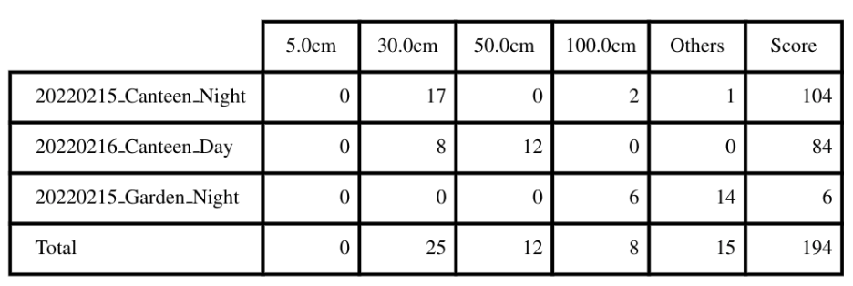

## Overview

* This visual [SLAM](https://en.wikipedia.org/wiki/Simultaneous_localization_and_mapping) benchmark is based on the [FusionPortable dataset](https://ram-lab.com/file/site/multi-sensor-dataset), which covers a variety of environments in [The Hong Kong University of Science and Technology](https://hkust.edu.hk) campus by utilizing multiple platforms for data collection. It provides a large range of difficult scenarios for Simultaneous Localization and Mapping (SLAM). 
* All these sequences are characterized by structure-less areas and varying illumination conditions to best represent the real-world scenarios and pose great challenges to the SLAM algorithms which were verified in confined lab environments. Accurate centimeter-level ground truth of each sequence is provided for algorithm verification. Sensor data contained in the dataset includes *10Hz* LiDAR point clouds, *20Hz* stereo frame images, high-rate and asynchronous events from stereo event cameras, *200Hz* acceleration and angular velocity readings from an IMU, and *10Hz* GPS signals in the outdoor environments. 
* Sensors are spatially and temporally calibrated.

## Hardware

* The sensors are mounted rigidly on an aluminium platform for handheld operation. An FPGA is utilized to generate an external signal trigger to synchronize clocks of all sensors. We install the sensor rig on various platforms to simulate distinguishable motions of different equipments, including a handheld device with a gimbal stabilizer, a quadruped robot, and an autonomous vehicle. 

| Sensor                      | Characteristics                            |
| --------------------------- | ------------------------------------------ |
| 3D LiDAR (**not provided**) | Ouster OS1-128, 128 channels, 120m range   |
| Frame Camera * 2            | FILR BFS-U3-31S4C， resolution: 1024 × 768 |
| Event Camera * 2            | DAVIS346, resolution: 346 × 240            |
| IMU (body_imu)              | STIM300                                    |
| GPS                         | ZED-F9P RTK-GPS                            |


* Calibration: The calibration file in *yaml* format can be downloaded [here](http://aiskyeye.com/download/fusionportable-vslam-2). We provide intrinsics & extrinsics of cameras as well as noise parameters of the IMU and also the raw calibration data. Intriniscs are calibrated using the MATLAB tool, and the extrinsics are calibrated using the [Kalibr](https://github.com/ethz-asl/kalibr). Taking the *frame_cam00.yaml* as an example, parameters are provided in the form as follows:

  ```yaml
  image_width: 1024
  image_height: 768
  camera_name: stereo_left_flir_bfsu3
  camera_matrix: !!opencv-matrix
    rows: 3
    cols: 3
    dt: f
    data: [ 6.05128601e+02, 0., 5.21453430e+02, 
            0., 6.04974060e+02, 3.94878479e+02, 
            0., 0., 1. ]
  ...
  # extrinsics from the sensor (reference) to bodyimu (target)
  quaternion_sensor_bodyimu: !!opencv-matrix
    rows: 1
    cols: 4
    dt: f
    data: [0.501677, 0.491365, -0.508060, 0.498754]  # (qw, qx, qy, qz)
  translation_sensor_bodyimu: !!opencv-matrix
    rows: 1
    cols: 3
    dt: f
    data: [0.066447, -0.019381, -0.077907]
  timeshift_sensor_bodyimu: 0.03497752745342453
  ```

  Rotational and translational calibration parameters from the camera (reference frame) to the IMU (target frame) are presented in the form of the Hamilton quaternion (*[qw, qx, qy, qz]*) and the translation vector (*[tx, ty, tz]*). The timeshift is obtained by the Kalibr.

## Evaluation

* The submission will be ranked based on the **completeness** and **frequency** of the trajectory as well as on the **position accuracy (ATE)**. The score is based on the ATE of individual points on the trajectory. Points with the error smaller than a distance threshold are added to your final score. This evaluation scheme is inspired by [HILTI Challenge](https://www.hilti-challenge.com/index.html).

* Output trajectories should be transformed into the *body_imu* frame, We will align the trajectory with the dense ground truth points using a rigid transformation. Then the Absolute Trajectory Error (ATE) of a set of discrete point is computed. At each ground truth point, extra penalty points are added to the final score depending on the amount of error at this point:

  | Error    | Score (points) |
  | -------- | -------------- |
  | <= 5cm   | 10             |
  | <= 30cm  | 6              |
  | <= 50cm  | 3              |
  | <= 100cm | 1              |
  | > 100cm  | 0              |

* Each sequence will be evaluated over a maximum of 200 points, which leads to a maximum of  $N\times 200$ points being evaluated among $N$ sequences.

**Given an example:**




## Submission Guidelines

* Trajectory Results

  * Please upload a .zip file consisting of a list of text files named as the *sequence name* shown as follows:

  ```
  20220215_canteen_night.txt
  20220215_garden_night.txt
  20220219_MCR_slow_00.txt
  20220226_campus_road_day.txt
  ....
  ```

  * The text files should have the following contents:

  ```
  1644928761.036623716 0.0 0.0 0.0 0.0 0.0 0.0 1.0
  ....
  ```

  Each row contains *timestamp_s tx ty tz qx qy qz qw*. The timestamps are in the unit of second which are used to establish temporal correspondences with the groundtruth. The first pose should be no later than the starting time specified above, and only poses after the starting time will be used for evaluation.

  * The poses should specify the poses of the body IMU in the world frame. If the estimated poses are in the frame of other sensors, one should transform these poses into the world frame of the body IMU as `T_bodyw_body = T_body_sensor * T_sensorw_sensor * T_body_sensor^(-1);`.

* Do not publicly release your trajectory estimates, as we might re-use some of the datasets for future competitions.

## Sequence

| Platform        |                                                              | Sequence               | Compressed Bag                                               |
| --------------- | ------------------------------------------------------------ | ---------------------- | ------------------------------------------------------------ |
| Handheld        |  | 20220216_canteen_night | [15.9GB](http://prcv-download.natapp1.cc/compressed/20220215_canteen_night.bag) |
|                 |                                                              | 20220216_canteen_day   | [17.0GB](http://prcv-download.natapp1.cc/compressed/20220216_canteen_day.bag) |
|                 |  | 20220215_garden_night  | [8.5GB](http://prcv-download.natapp1.cc/compressed/20220215_garden_night.bag) |
|                 |                                                              | 20220216_garden_day    | [20.4GB](http://prcv-download.natapp1.cc/compressed/20220216_garden_day.bag) |
|                 |  | 20220216_corridor_day  | [27.4GB](http://prcv-download.natapp1.cc/compressed/20220216_corridor_day.bag) |
|                 |  | 20220216_escalator_day | [31.7GB](http://prcv-download.natapp1.cc/compressed/20220216_escalator_day.bag) |
|                 |  | 20220225_building_day  | [37.5GB](http://prcv-download.natapp1.cc/compressed/20220225_building_day.bag) |
|                 |  | 20220216_MCR_slow      | [3.5GB](http://prcv-download.natapp1.cc/compressed/20220216_MCR_slow.bag) |
|                 |                                                              | 20220216_MCR_normal    | [2.2GB](http://prcv-download.natapp1.cc/compressed/20220216_MCR_normal.bag) |
|                 |                                                              | 20220216_MCR_fast      | [1.7GB](http://prcv-download.natapp1.cc/compressed/20220216_MCR_fast.bag) |
| Quadruped Robot |  | 20220219_MCR_slow_00   | [9.7GB](http://prcv-download.natapp1.cc/compressed/20220219_MCR_slow_00.bag) |
|                 |                                                              | 20220219_MCR_slow_01   | [8.4GB](http://prcv-download.natapp1.cc/compressed/20220219_MCR_slow_01.bag) |
|                 |                                                              | 20220219_MCR_normal_00 | [7.1GB](http://prcv-download.natapp1.cc/compressed/20220219_MCR_normal_00.bag) |
|                 |                                                              | 20220219_MCR_normal_01 | [6.5GB](http://prcv-download.natapp1.cc/compressed/20220219_MCR_normal_01.bag) |
|                 |                                                              | 20220219_MCR_fast_00   | [7.6GB](http://prcv-download.natapp1.cc/compressed/20220219_MCR_fast_00.bag) |
|                 |                                                              | 20220219_MCR_fast_01   | [8.5GB](http://prcv-download.natapp1.cc/compressed/20220219_MCR_fast_01.bag) |
| Apollo Vehicle  |  | 20220226_campus_road   | [72.3GB](http://prcv-download.natapp1.cc/compressed/20220226_campus_road_day.bag) |

* Detailed statistics are shown:

  

* Download link can be found [here](http://aiskyeye.com/download/fusionportable-vslam-2/)

## FAQ

- **How are the frames defined on the sensor setup?**

The picture below is a schematic illustration of the reference frames (red = x, green = y, blue = z):


- **How are the results scored?**

The results submitted by each team will be scored based on the completeness and ATE accuracy of the trajectories. All the results will be displayed in  the live leaderboard. Each trajectory will be scored based on the standard evaluation points, the accumulation of the scores of all these evaluation points is normalized to 100 points to get the final score of the sequence. Each evaluation point can get 0-10 points according to its accuracy.

- **Will the organizer provide the calibration datasets of the IMU and camera?**

Of course, we will provide the calibration data of IMU and cameras.

- **Is the ground truth available?**

We will provide some sample datasets along with their ground truth collected with the same sensor kit, but the ground truth for the challenge sequences is not available. However, you can submit your own results in the website evaluation system for evaluation.

## Reference

*[1] Jianhao Jiao, Hexiang Wei, Tianshuai Hu, Xiangcheng Hu, etc., Lujia Wang, Ming Liu, FusionPortable: A Multi-Sensor Campus-Scene Dataset for Evaluation of Localization and Mapping Accuracy on Diverse Platforms, IEEE/RSJ International Conference on Intelligent Robots and Systems (IROS), 2022, Kyoto, Japan.*