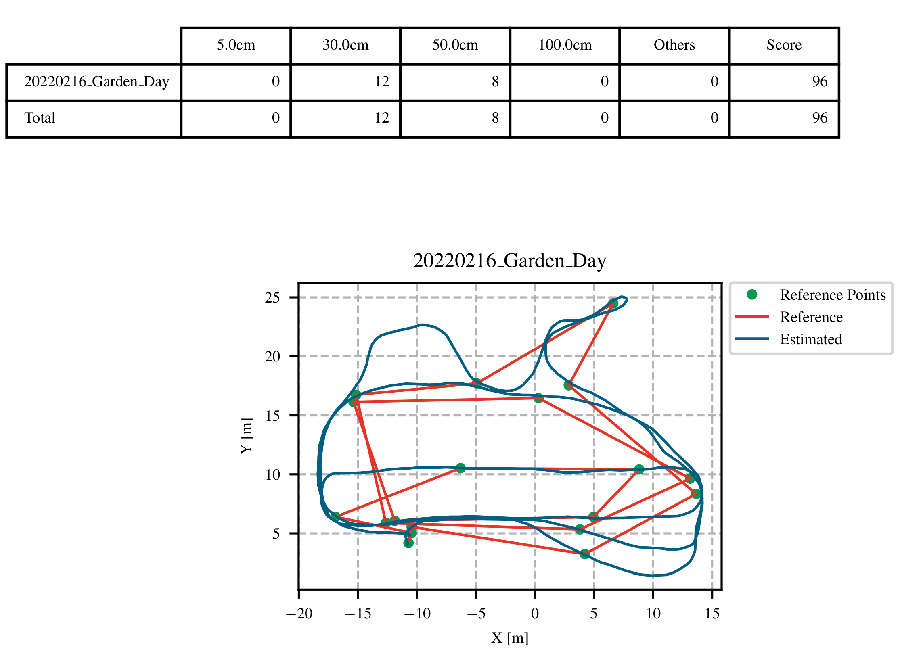

# Evaluation of estimated trajectories for PRCV 2022 



### Installation

The package is written in python and tested in Ubuntu 16.04 and 18.04.
Both `python2` and `python3` are supported.

**Dependencies**: You will need install the following:

* `numpy` and `matplotlib` for the analysis/plotting: 
```pip install numpy matplotlib```

* `colorama` for colored console output
```pip install colorama```

* `ruamel.yaml` ([install](https://pypi.org/project/ruamel.yaml/)) for [preserving the order in yaml configurations](https://stackoverflow.com/questions/5121931/in-python-how-can-you-load-yaml-mappings-as-ordereddicts)
  ```pip install ruamel.yaml```

* if you can not generate the pdf plot file，please check your latex lib.

  ```
  sudo apt install  texlive-latex-base texlive-fonts-recommended texlive-fonts-extra texlive-latex-extra
  ```

### Run the evaluation code
1. Set configuration files: [PRCV2022.yaml](evaluation/rpg_trajectory_evaluation/analyze_trajectories_config/PRCV2022.yaml)

2. Set the **Base_Folder** in the bash file: [run_traj_eval_PRCV2022.sh](evaluation/script/bash/run_traj_eval_PRCV2022.sh)

3. Set the PRCV2022 VSLAM scoring rule: [rule_score_PRCV2022.py](evaluation/rpg_trajectory_evaluation/scripts/rule_score_PRCV2022.py)
* ATE <= 5CM: 10
* ATE <= 30CM: 6
* ATE <= 50CM: 3
* ATE <= 100CM: 1
* ATE > 100CM: 0

4. Run the script: [run_traj_eval_PRCV2022.sh](evaluation/script/bash/run_traj_eval_PRCV2022.sh) for evaluation: 
```bash run_traj_eval_PRCV2022.sh```

5. Please check line 528 in [analyze_trajectories_PRCV2022.py](evaluation/rpg_trajectory_evaluation/scripts/analyze_trajectories_PRCV2022.py) for the exception handle (i.e., format error).

6. The evaluation report will be saved as a pdf file [estimated_trajectory_top.pdf](benchmark/estimated/report/estimated_trajectory_top.pdf)

### Having questions with the evaluation code?
1. Please contact Dr.Jianhao Jiao (jiaojh1994@gmail.com)